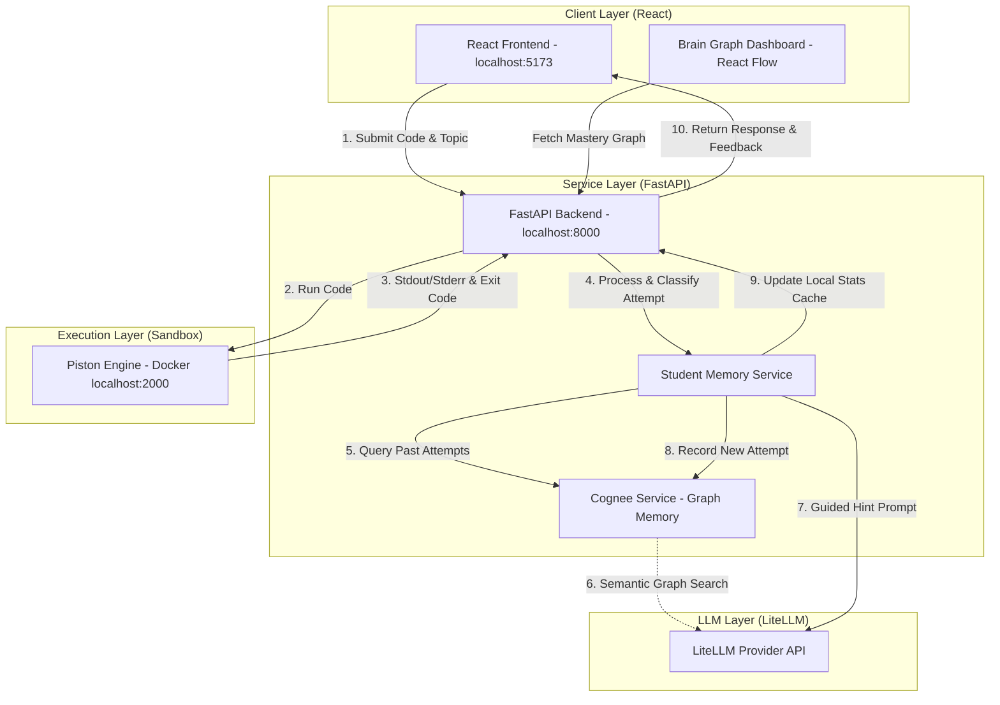

# AI Coding Mentor 🧠💻

<p align="center">
  <em>An agentic AI tutor that teaches you to debug your own code — not just fix it for you.</em>
</p>

<p align="center">
  
  
  
  
  
  
  
</p>

<p align="center">
  
</p>

**AI Coding Mentor** is an intelligent, agentic tutoring platform built to help students master coding concepts through guided, step-by-step feedback rather than handed-out solutions.

It brings together:
- A **React frontend** for an interactive coding workspace
- A **FastAPI backend** for orchestrating submissions and feedback
- A **Dockerized Piston sandbox** for safe, isolated code execution
- A **Cognee-powered graph memory system** that tracks student mistakes and mastery over time using LLM-driven embeddings and vector search

---

## 📑 Table of Contents

- [Key Features](#-key-features)
- [Tech Stack](#-tech-stack)
- [System Architecture](#-system-architecture)
- [Prerequisites](#-prerequisites)
- [Port Mappings](#-port-mappings)
- [Local Setup](#-local-setup)
- [Roadmap](#-roadmap)
- [Contributing](#-contributing)
- [Pre-PR Checklist](#-pre-pr-checklist)
- [License](#-license)
- [Acknowledgments](#-acknowledgments)

---

## ✨ Key Features

| Feature | Description |
| :--- | :--- |
| **Practice & Exam Modes** | Solve coding challenges in Java, C++, Python, or JavaScript |
| **Guided Hint Feedback** | Instead of copy-paste solutions, the AI analyzes syntax/runtime results and guides students to find their own fix |
| **Mistake Memory & Mastery Graph** | Cognee maps past failures and successes into a semantic knowledge graph, resurfacing relevant past lessons when similar bugs recur |
| **Weakness Topic Detector** | A React Flow–powered "Brain Graph" dashboard visualizes mastery (Strong / Average / Weak) across topics like Arrays, Strings, Trees, Graphs, and DP |

---

## 🧰 Tech Stack

| Layer | Technology |
| :--- | :--- |
| **Frontend** | React, Vite, React Flow |
| **Backend** | FastAPI (Python) |
| **Code Execution** | Piston (Dockerized sandbox) |
| **Memory / Knowledge Graph** | Cognee (graph + vector store) |
| **LLM Layer** | LiteLLM (provider-agnostic — Gemini, OpenAI, etc.) |
| **Containerization** | Docker |

---

## 🏗️ System Architecture

The diagram below shows how a code submission flows through the system — from the frontend, through execution and evaluation, to memory storage and feedback.



---

## ✅ Prerequisites

Make sure the following are installed locally before setup:

- **Docker** — for hosting the Piston code sandbox
- **Node.js** (v18+) — for the React frontend
- **Python** (v3.10+) — for the FastAPI backend

---

## 🔌 Port Mappings

| Service | Address | Description |
| :--- | :--- | :--- |
| **React Frontend** | `http://localhost:5173` | UI workspace, dashboard, and React Flow graphs |
| **FastAPI Backend** | `http://localhost:8000` | Handles submissions and serves mastery records |
| **Piston Sandbox** | `http://localhost:2000` | Isolated multi-language code execution engine |

---

## 🚀 Local Setup

### 1. Start the Piston Code Sandbox

Piston runs student code submissions inside an isolated Docker container. Start it with:

```bash
docker run --name piston_api --privileged -p 2000:2000 -v piston_data:/piston -d ghcr.io/engineer-man/piston
```

**Verify it's running:**
```bash
curl http://localhost:2000/api/v2/packages
```

> 💡 The `--privileged` flag and `piston_data` volume are required by Piston to manage its language runtimes and sandboxing correctly.

---

### 2. Configure the FastAPI Backend

1. Move into the backend directory:
   ```bash
   cd backend
   ```

2. Create and activate a virtual environment:

   **Windows (PowerShell):**
   ```powershell
   python -m venv venv
   .\venv\Scripts\Activate.ps1
   ```

   **Linux/macOS:**
   ```bash
   python -m venv venv
   source venv/bin/activate
   ```

3. Install dependencies:
   ```bash
   pip install -r requirements.txt
   ```

4. Create a `.env` file inside the `backend` folder:
   ```env
   LLM_PROVIDER=gemini
   LLM_MODEL=gemini-1.5-flash
   LLM_API_KEY=your_gemini_api_key_here

   # Optional — falls back to defaults if omitted
   EMBEDDING_PROVIDER=gemini
   EMBEDDING_MODEL=text-embedding-004
   ```

5. Launch the server:
   ```bash
   uvicorn main:app --reload --port 8000
   ```

   API docs will be available at `http://localhost:8000/docs`.

---

### 3. Run the React Frontend

1. Move into the frontend directory:
   ```bash
   cd ../frontend
   ```

2. Install dependencies:
   ```bash
   npm install
   ```

3. Start the dev server:
   ```bash
   npm run dev
   ```

4. Open `http://localhost:5173` in your browser to start exploring the workspace!

---

## 🤝 Contributing

We welcome contributions from the community! To get started:

1. **Fork** the repository on GitHub.
2. **Create a feature branch** off `main`:
   ```bash
   git checkout -b feature/your-awesome-feature
   ```
3. **Commit your changes** with clear, descriptive messages:
   ```bash
   git commit -m "feat: integrate dynamic metrics for topic selections"
   ```
4. **Push your branch:**
   ```bash
   git push origin feature/your-awesome-feature
   ```
5. **Open a Pull Request** describing your change and the reasoning behind it.

---

## ✔️ Pre-PR Checklist

Before submitting a Pull Request, confirm that:

- [ ] The FastAPI server runs without CORS errors for requests from `http://localhost:5173`
- [ ] New React components use hooks correctly and contain no hardcoded mock timers
- [ ] The Python backend passes static imports (e.g., `cognee_service.improve_graph` is callable)

---

## 🗺️ Roadmap

- [ ] Support for additional languages (Go, Rust, TypeScript)
- [ ] Instructor dashboard for classroom-wide mastery tracking
- [ ] Exportable progress reports (PDF/CSV)
- [ ] Voice-based guided hints
- [ ] Multi-user collaborative debugging sessions

> Have an idea? Open an [issue](../../issues) or start a [discussion](../../discussions).

---

## 📄 License

This project is licensed under the **MIT License** — see the [LICENSE](LICENSE) file for details.

---

## 🙏 Acknowledgments

- [Piston](https://github.com/engineer-man/piston) — for the secure, multi-language code execution engine
- [Cognee](https://www.cognee.ai/) — for the graph + vector memory framework powering mistake tracking
- [React Flow](https://reactflow.dev/) — for the interactive Brain Graph visualizations
- [LiteLLM](https://www.litellm.ai/) — for unified access to LLM providers

---

<p align="center">Made with ❤️ to help students learn to debug, not just copy-paste.</p>
